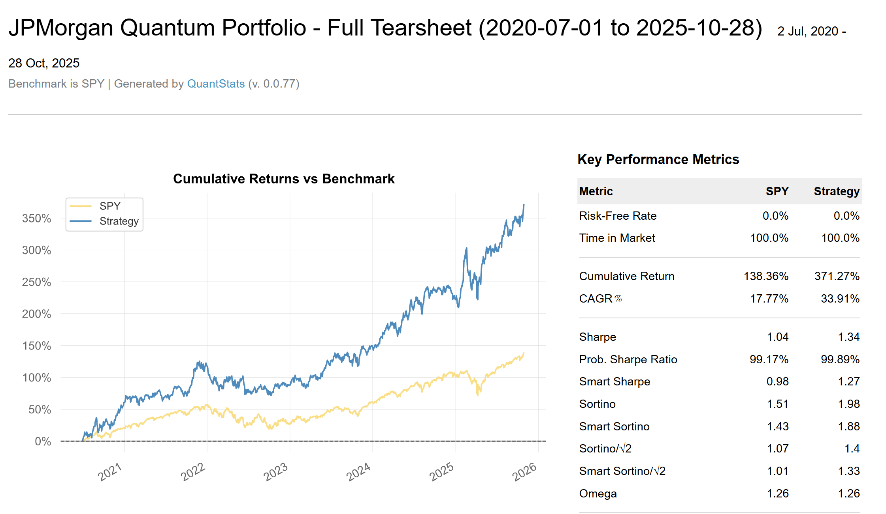

# Qfolio

> Quantum-enhanced portfolio optimization with AMSP encoding and Spectral Clustering decomposition

[](https://www.python.org/downloads/)
[](https://opensource.org/licenses/MIT)
[](https://github.com/pcchouCR97/Qfolio/blob/main/paper/paper.pdf)

Qfolio is a portfolio optimization research package that benchmarks classical and quantum solvers under realistic market conditions. The project compares NumPy-based classical optimizers and the Quantum Approximate Optimization Algorithm (QAOA), Variational Quantum Eigensolver (VQE), implemented using [Qiskit](https://qiskit.org/), to assess their performance across bull and bear market regimes.

**[Quick Start](#quick-start) | [Examples](#examples--tutorials) | [Features](#features) | [Report](https://github.com/pcchouCR97/Qfolio/blob/main/paper/paper.pdf) | [⭐ Star](https://github.com/pcchouCR97/Qfolio) | [Citation](#citation)**

---

## Quick Start

### Installation

```bash
# Clone repository
git clone https://github.com/pcchouCR97/Qfolio.git
cd Qfolio

# Create virtual environment
python -m venv qfolio_dev
source qfolio_dev/bin/activate  # Linux/Mac
qfolio_dev\Scripts\activate     # Windows

# Install package
pip install -e .
```

### 5-Minute Example

```python
# Run Spectral Clustering decomposition optimization
from qfolio.optimization.jpmorgan_pipeline import run_jpmorgan_pipeline
from qfolio.screeners.sharpe_screener import load_data

# Load S&P 500 sample data (42 stocks)
data = load_data("examples/example_csv/SP500_42stocks_baseline_adjusted_close_103025.csv")

# Select assets
tickers = ['AAPL', 'MSFT', 'NVDA','AVGO','ORCL','V']
current_prices = data.iloc[-1][tickers].values

# Run optimization
weights = run_jpmorgan_pipeline(
    prices_data=data,
    tickers=tickers,
    budget=10000,
    current_prices=current_prices,
    quantum_solver='classic',  # or 'QAOA', 'SamplerVQE' for quantum algorithm
    max_community_size=3
)
print(tickers)
print(f"Optimal weights: {weights}")
```

### Run Example Backtests

```bash
# To-date backtest - Run backtest up to a specific date
python examples/AMSP_example_backward_looking.py

# Standard AMSP backtest - Basic portfolio optimization with rebalancing
python examples/AMSP_example.py

# Spectral Clustering decomposition backtest - Uses decomposition pipeline with community detection
python examples/AMSP_JP_backtest.py

# Magnificent 7 backtest - Test on tech giants
python examples/AMSP_testbed_Mag7.py

# Grid study - Parameter exploration across multiple configurations
python examples/AMSP_example_explore_regular.py
```

---

## Examples & Tutorials

### Python Scripts

Run complete backtests from the command line:

#### 1. Standard AMSP Backtest
```bash
python examples/AMSP_example.py
```
Compare classical (NumPy) vs quantum (QAOA) solvers on multi-asset portfolio with AMSP encoding. Generates QuantStats HTML report with 50+ performance metrics.

**Key Features:**
- AMSP binary encoding for QUBO representation
- Supporting fraction shares
- Forward-looking backtest with periodic rebalancing
- Comprehensive QuantStats tearsheet

**Results QuantStats example**


Full report: <a href="quantstats_reports/portfolio_report_2020-07-01_2025-10-28.html">View Portfolio Report</a>

#### 2. Spectral Clustering Decomposition Pipeline
```bash
python examples/AMSP_JP_backtest.py
```
Large-scale portfolio optimization using Random Matrix Theory preprocessing and spectral clustering. Demonstrates decomposition for 42+ stock portfolios.

**Key Features:**
- RMT (Marchenko-Pastur) noise filtering
- Newman's spectral bisection clustering
- Per-community optimization and aggregation
- Scalable to large universes

**Results QuantStats example**



Full report: <a href="quantstats_reports_JP\portfolio_report_JP_2020-07-01_2025-10-28.html">View Portfolio Report</a>


#### 3. Backward-Looking Analysis
```bash
python examples/AMSP_example_backward_looking.py
```
Historical performance analysis mode for research and validation studies. Uses complete dataset for retrospective analysis.

---

### Interactive Jupyter Tutorials

Explore step-by-step guides in [`examples/tutorial/`](examples/tutorial/):

#### [Qfolio_VOO_Benchmark_Tutorial.ipynb](examples/tutorial/Qfolio_VOO_Benchmark_Tutorial.ipynb)
- Compare portfolio performance vs VOO ETF benchmark
- Visualize cumulative returns and drawdowns

**What you'll learn:**
- Loading and preprocessing stock data
- Running optimization with classical and quantum solvers on your local machine

#### [Qfolio_AMSP_42_Stocks_Tutorial.ipynb](examples/tutorial/Qfolio_AMSP_42_Stocks_Tutorial.ipynb)
- Walk through 42-stock S&P 500 portfolio optimization
- Deep dive into AMSP encoding mechanics
- Spectral Clustering decomposition methodology

**What you'll learn:**
- AMSP encoding
- RMT preprocessing and eigenvalue filtering
- Spectral clustering for community detection

---

## Features

### Optimization Algorithms
- **Classical Solvers**: NumPy, CPLEX, Gurobi (need license), SCIP(in development)
- **Quantum Solver**: QAOA (Quantum Approximate Optimization Algorithm), SamplerVQE (Variational Quantum Eigensolver)

### Advanced Techniques
- **AMSP Encoding**: Adaptive Multi-Scale Pricing for efficient binary representation of portfolio positions
- **Spectral Clustering Pipeline**: Random Matrix Theory preprocessing + Newman's spectral bisection clustering
- **Risk Management**: CVaR optimization, Sharpe ratio screening, dynamic asset universe
- **Market Calendar Integration**: NYSE trading days with `pandas_market_calendars`

### Analysis & Reporting
- **QuantStats Integration**: Professional tearsheet reports with 50+ performance metrics
- **Performance Metrics**: Sharpe ratio, Sortino ratio, max drawdown, CVaR, rolling volatility
- **Bull/Bear Case Studies**: Real VOO ETF data (2023-2024) with market regime analysis
- **Visualization**: Return comparisons, allocation evolution, risk-return profiles

### Backtesting Framework
- Forward-looking backtests with no look-ahead bias
- Periodic rebalancing with configurable frequency (daily/monthly)
- Dynamic asset universe with eligibility tracking
- Transaction cost modeling (optional)
- Consistent returns calculation with `StatisticCalculatorRollingD`

---

## Analysis & Reporting

### QuantStats Integration

Automatically generate professional performance tearsheets:

```bash
python examples/AMSP_JP_backtest.py
# Output: quantstats_reports_JP/portfolio_report_[dates].html
```

**50+ Metrics Included:**
- Cumulative returns vs benchmark (SPY/VOO)
- Sharpe ratio, Sortino ratio, Calmar ratio
- Maximum drawdown, volatility analysis
- Value at Risk (VaR), Conditional VaR (CVaR)
- Beta, R-squared vs benchmark
- Monthly returns heatmap
- Rolling performance charts (Sharpe, volatility, beta)
- Distribution analysis and tail risk

Reports saved to [`quantstats_reports_JP/`](quantstats_reports_JP/) directory. Open HTML files in any browser for interactive exploration.

---

## Background

Portfolio optimization is a foundational challenge in finance, with classical methods often struggling under computational complexity in combinatorial cases. Qfolio reformulates the portfolio selection task into a Quadratic Unconstrained Binary Optimization (QUBO) problem and explores how quantum algorithms like QAOA can enhance solution quality and efficiency.

The methodology draws upon:
- Hamiltonian formulations of return and risk trade-offs
- Binary encoding to enable QUBO compliance
- Qiskit's classical and quantum solvers
- Benchmarks based on real S&P 500 data (via the VOO ETF)

---

## Package Structure

```
qfolio/
├── optimization/          # Portfolio optimization algorithms
│   ├── jpmorgan_pipeline.py    # RMT + Spectral Clustering
│   ├── hamiltonian.py          # QUBO Hamiltonian formulation
│   ├── amsp_encoder.py         # AMSP encoding utilities
│   └── core.py                 # Backtest orchestration
├── screeners/            # Asset screening
│   └── sharpe_screener.py      # Sharpe ratio-based selection
├── backtesting/          # Backtesting framework
│   ├── PortfolioManager_AMSP.py
│   ├── date_loader.py          # Market calendar utils
│   └── portfolio.py            # Portfolio analytics
├── data/                 # Data management
│   └── DataManager.py          # CSV/API data loading
├── analysis/             # Performance analysis
│   ├── comparison.py           # Solver comparison
│   └── metrics.py              # Performance calculations
├── metrics/              # Risk metrics
│   └── RiskMetrics.py          # CVaR, VaR, etc.
├── results/              # Results management
│   └── exporter.py             # Save backtest results
└── visualization/        # Plotting utilities
    └── plotter.py              # Portfolio visualizations

examples/                 # Example backtests & tutorials
├── AMSP_example.py              # Standard AMSP backtest
├── AMSP_JP_backtest.py          # Spectral Clustering pipeline backtest
├── AMSP_example_backward_looking.py  # Historical analysis
├── example_csv/                 # Sample S&P 500 data
└── tutorial/                    # Jupyter notebooks
    ├── Qfolio_VOO_Benchmark_Tutorial.ipynb
    └── Qfolio_AMSP_42_Stocks_Tutorial.ipynb
```

---

## Documentation

### Python API

```python
# Spectral Clustering Pipeline
from qfolio.optimization.jpmorgan_pipeline import run_jpmorgan_pipeline

# Sharpe Screening
from qfolio.screeners.sharpe_screener import SharpeRatioCalculator

# Risk Metrics
from qfolio.metrics.RiskMetrics import RiskMetricsCalculator

# Data Management
from qfolio.data.DataManager import DataManager

# Backtesting Core
from qfolio.optimization.core import BackTrackCore, OptimizationConfig
```

---

## Contributing

We welcome contributions! Whether you're fixing bugs, adding features, or improving documentation, your help is appreciated.

---

## Citation

If you use Qfolio in your research, please cite:

```bibtex
@article{chou2024qfolio,
  title={Qfolio: Quantum-Enhanced Portfolio Optimization with AMSP Encoding},
  author={Chou, Po-Chih},
  journal={GitHub Repository},
  year={2024},
  url={https://github.com/pcchouCR97/Qfolio}
}
```

---

## References

- [Decomposition Pipeline for Large-Scale Portfolio Optimization with Applications to Near-Term Quantum Computing (arXiv:2409.10301)](https://arxiv.org/abs/2409.10301)
- [Ahmed (2002) - Portfolio Optimization](https://www2.isye.gatech.edu/~shabbir/ISyE6669/)
- [D-Wave Portfolio Optimization Examples](https://github.com/dwave-examples/portfolio-optimization)
- [Qiskit Finance Portfolio Optimization Tutorial](https://qiskit-community.github.io/qiskit-finance/tutorials/01_portfolio_optimization.html)
- [Vanguard VOO ETF Data](https://investor.vanguard.com/investment-products/etfs/profile/voo)
- [Qfolio Paper - GitHub](https://github.com/pcchouCR97/Qfolio/blob/main/paper/paper.pdf)
- [Qiskit Finance - IBM](https://github.com/qiskit-community/qiskit-finance/blob/stable/0.4/docs/tutorials/01_portfolio_optimization.ipynb)
- [QAOA - Qiskit Algorithms](https://qiskit-community.github.io/qiskit-algorithms/stubs/qiskit_algorithms.QAOA.html#qiskit_algorithms.QAOA.sampler) 
- [SamplerVQE - Qiskit Algorithms](https://qiskit-community.github.io/qiskit-algorithms/stubs/qiskit_algorithms.SamplingVQE.html) 
- [Portfolio Optimization using D-Wave](https://github.com/dwave-examples/portfolio-optimization/tree/main)

---

## License

This project is licensed under the MIT License - see the [LICENSE](LICENSE) file for details.

---

## Acknowledgments

- Built with [Qiskit](https://qiskit.org/) for quantum computing
- Market data from [Yahoo Finance](https://finance.yahoo.com/) via `yfinance`
- Performance analysis powered by [QuantStats](https://github.com/ranaroussi/quantstats)

---

**Questions?** Open an [issue](https://github.com/pcchouCR97/Qfolio/issues) or reach out to [pcchouCR97@gmail.com](mailto:pcchouCR97@gmail.com)
